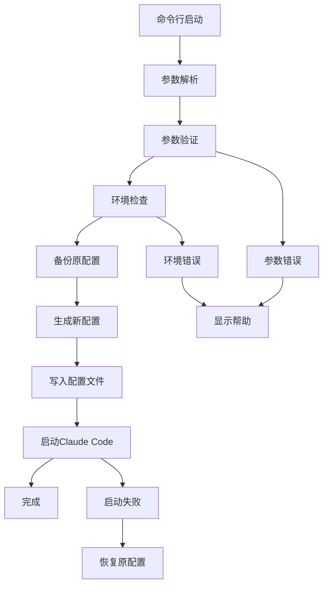

# Claude Code 启动脚本产品需求文档

## 1. 产品概述

本项目旨在开发一个Claude Code启动脚本，通过命令行参数动态配置模型参数，替代当前硬编码在~/.claude/settings.json中的配置方式。

该脚本将提供灵活的模型配置管理，支持多种模型配置的快速切换，提升开发者使用Claude Code的便利性和效率。

## 2. 核心功能

### 2.1 用户角色

| 角色 | 使用方式 | 核心权限 |
|------|----------|----------|
| 开发者 | 命令行直接使用 | 可以通过参数配置模型、切换配置文件、查看当前配置 |

### 2.2 功能模块

我们的Claude Code启动脚本需求包含以下主要页面：
1. **命令行界面**：参数解析、配置验证、帮助信息显示
2. **配置管理界面**：配置文件读取、动态配置生成、配置备份恢复
3. **启动控制界面**：Claude Code进程启动、环境检查、错误处理

### 2.3 页面详情

| 页面名称 | 模块名称 | 功能描述 |
|----------|----------|----------|
| 命令行界面 | 参数解析器 | 解析命令行参数，支持模型名称、API密钥、配置文件路径等参数 |
| 命令行界面 | 帮助系统 | 显示使用说明、参数列表、示例命令 |
| 命令行界面 | 参数验证 | 验证输入参数的有效性，检查必需参数 |
| 配置管理界面 | 配置文件读取 | 读取现有的~/.claude/settings.json配置 |
| 配置管理界面 | 动态配置生成 | 根据命令行参数生成新的配置内容 |
| 配置管理界面 | 配置备份恢复 | 备份原始配置文件，支持恢复功能 |
| 启动控制界面 | 环境检查 | 检查Claude Code是否已安装，验证依赖环境 |
| 启动控制界面 | 进程启动 | 启动Claude Code应用程序 |
| 启动控制界面 | 错误处理 | 处理启动过程中的各种错误情况 |

## 3. 核心流程

用户通过命令行执行启动脚本，传入模型配置参数。脚本首先解析和验证参数，然后备份现有配置文件，根据参数生成新的配置内容并写入~/.claude/settings.json，最后启动Claude Code应用程序。

## 4. 用户界面设计

### 4.1 设计风格

- 主色调：终端默认颜色（黑白为主）
- 辅助色：绿色（成功信息）、红色（错误信息）、黄色（警告信息）
- 字体：等宽字体，适合终端显示
- 布局风格：命令行界面，简洁明了
- 图标风格：使用ASCII字符和简单符号

### 4.2 页面设计概览

| 页面名称 | 模块名称 | UI元素 |
|----------|----------|--------|
| 命令行界面 | 参数解析器 | 命令行参数提示，彩色输出，进度指示器 |
| 命令行界面 | 帮助系统 | 格式化的帮助文本，参数说明表格，使用示例 |
| 配置管理界面 | 配置文件操作 | 操作状态提示，配置内容预览，确认提示 |
| 启动控制界面 | 进程控制 | 启动状态显示，错误信息格式化，成功确认 |

### 4.3 响应性

该产品为命令行工具，主要在终端环境中运行，支持跨平台使用（Windows、macOS、Linux）。